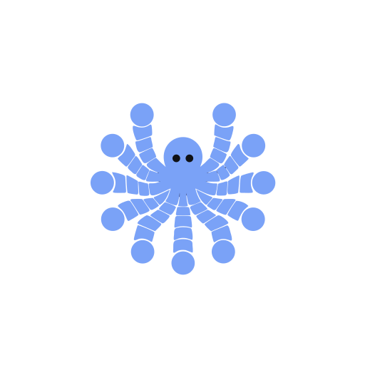

# mnemo-desktop

Desktop shell for the mnemo agentic development environment. Sub-project 1: a terminal with tabs, splits and a command palette, enough to replace your daily terminal so the mission cockpit (sub-project 2) can live on screen.

## Dev

    brew install cmake        # whisper-rs (voice) builds against it
    pnpm install
    pnpm tauri dev

Run your parent Claude Code session inside the app from the repo whose project memory you want (`cd ~/github/mnemo && claude --continue`); dispatch children then appear in the mission sidebar.

## Install

    pnpm run install-app

Builds the release bundle, quits the running app, swaps it into `/Applications/mnemo.app` and relaunches it — one command, and the one to run after every merge. Safe to run from a pane of the app it is replacing: the swap runs detached, so quitting the app cannot kill the install halfway. `--no-launch` leaves the app closed.

The app then says which commit it is: the short sha and the build time are stamped in at build time, and shown in the command palette's about line and by `mnemo-desktop --version`.

    /Applications/mnemo.app/Contents/MacOS/mnemo-desktop --version
    mnemo-desktop 0.1.0 (948abbe, built 2026-09-15 16:41 UTC)

So a bundle from before the merge reads as old instead of looking like a missing feature. After a merge, `pnpm run install-app:check` prints one line when the installed app is behind `main`, and nothing at all when it is current or not installed — a merge routine (`mnemo land --merge`, say, which lives in the `mnemo` repo) can call it unconditionally:

    bundle installed at 2026-09-15 10:49 is behind main (6 commits); run `pnpm run install-app`

## Test

    pnpm test                                        # front-end
    cargo test --manifest-path src-tauri/Cargo.toml  # core
    MNEMO_DESKTOP_SMOKE=1 ../.mnemo-desktop-target/debug/mnemo-desktop   # shell round-trip, exit 0 (target dir is shared across worktrees, see .cargo/config.toml)

## Shortcuts

⌘T new tab · ⌘W close pane · ⌘⇧W close tab · ⌘D split right · ⌘⇧D split down · ⌘⌥arrows focus · ⌘1-9 tab · ⌘⇧[ ] cycle · ⌘K palette · ⌘B mission sidebar · ⌘⇧B cockpit · ⌥Space hold to dictate (Ctrl on Linux/Windows)

In a terminal: ⌘←/⌘→ line start/end, ⌘⌫ kill line, ⌥⌫ kill word, ⌘C/⌘V clipboard, Shift+Enter newline (Claude Code).

Panes: terminal, editor (Monaco), browser (native webview), mission (a dispatch child's timeline), cockpit (all repos), vault (mnemo rules with the native actions as buttons), marketplace (shared rule sets). Open them from ⌘K.

## Replying to a child

A blocked child's reply box has two ways out. **send** posts to the child's inbox socket; Claude Code hands that to the child as another session's message, which can never approve a push, a merge or a PR. **reply as me** types the draft, exactly as written (no English rewrite, no language footer), into a hidden `claude attach <id>`, presses Enter and detaches with Ctrl+Z, so the child reads it as its user's typed turn. It refuses, and types nothing, when the child is on a permission or other prompt (Enter there picks "1. Yes" and the text is lost), when the child's input box already holds text (every attach shares that box, and Enter would send both), and when the draft is still the child's own suggested reply.

## Settings

`~/.mnemo-desktop/settings.json`, toggled from ⌘K: `outgoing` (`en` rewrites replies and dictation in English through your own `claude -p` before they leave, keeping the text as typed when it is under four words or the answer does not look like a rewrite; `as-typed` sends verbatim), `replyLanguage` (`pt`/`en`/`unchanged`, asks a child to answer in that language), `sidebarScope` (`repo`/`all`).

## Desktop MCP

The app serves the Claude Code sessions it hosts an MCP server named `desktop`, so an agent can look at the other panes instead of asking you to paste them:

- `desktop_list_panes`: every pane with its id, view, title, cwd, url (browser panes), tab and focus.
- `desktop_terminal_read(pane, lines)`: the last `lines` (default 100) of a terminal, scrollback included.
- `desktop_browser_read(pane)`: a browser pane's page as text (title, url, visible content as light markdown), logins included.
- `desktop_pane_snapshot(pane)`: a screenshot of a browser pane (macOS).

The server is a second binary, `mnemo-desktop-mcp`, that Claude Code starts over stdio; it relays each call to the running app over `~/.mnemo-desktop/mcp.sock` (owner-only). On start the app links the binary of the build you launched to `~/.mnemo-desktop/bin/mnemo-desktop-mcp`, writes `~/.mnemo-desktop/mcp.json`, and, if your Claude config has no user-scope server named `desktop`, runs the one-time equivalent of:

    claude mcp add --scope user desktop -- ~/.mnemo-desktop/bin/mnemo-desktop-mcp

New sessions then have the tools; `/mcp` in a session shows it. That happens once (`~/.mnemo-desktop/mcp-registered` remembers it), so `claude mcp remove --scope user desktop` sticks. To add it by hand instead, or for one project only (`--scope local`), run that line yourself; to try it without touching your Claude config, `claude --mcp-config ~/.mnemo-desktop/mcp.json`. With the app closed the tools answer "the mnemo desktop app is not running"; with several apps open, the one started last serves. `tauri dev` builds only the app binary, so run `cargo build --manifest-path src-tauri/Cargo.toml --bin mnemo-desktop-mcp` (same target dir) before trying it from a dev build.

A debug build (`tauri dev`) keeps all of this in `~/.mnemo-desktop-dev/` instead: its own workspace, settings, usage log, marketplace, shell integration, `mcp.sock` and `mcp.json`, so it never restores, overwrites or serves over the installed app's. Only the downloads are shared (`tools/`, voice `models/`). Every pane gets `MNEMO_DESKTOP_MCP_SOCKET` set to its own app's socket, so a session reaches the app it runs in, whichever build's binary it started. On restore, a saved session that a running `claude` already holds (`claude agents --json` gives it a pid) is not resumed: the pane keeps the session id and opens a plain shell. When the lookup fails, no session is resumed.

## Shell integration

⌘D and ⌘T open the new shell where you are: the focused terminal's directory, an editor's root, a mission pane's worktree, or on Home the selected repo; otherwise your home directory. Terminals report their directory with OSC 7 at each prompt, which the app turns on for your default shell without touching your dotfiles:

- **zsh**: starts with `ZDOTDIR=~/.mnemo-desktop/shell/zsh`. Those files source your own `.zshenv`, `.zprofile`, `.zshrc` and `.zlogin` (from your `ZDOTDIR`, else `$HOME`), add a `precmd` hook, and put `ZDOTDIR` back once startup is done.
- **bash**: starts as `bash --rcfile ~/.mnemo-desktop/shell/bash/mnemo.bashrc`, which loads `/etc/profile` and your `~/.bash_profile` (or `~/.bash_login`, `~/.profile`) and prepends a hook to `PROMPT_COMMAND`.
- **fish** reports its directory on its own. Other shells get no hook.

Every shell also gets `TERM_PROGRAM=mnemo` and `TERM_PROGRAM_VERSION`. The app rewrites the files under `~/.mnemo-desktop/shell/` when they differ from the built-in copy, so edits there do not stick. To opt out, set `MNEMO_NO_SHELL_INTEGRATION=1`: in the app's environment it starts shells as before, in your own startup files it skips the hook.

Specs and plans: `docs/superpowers/`.
